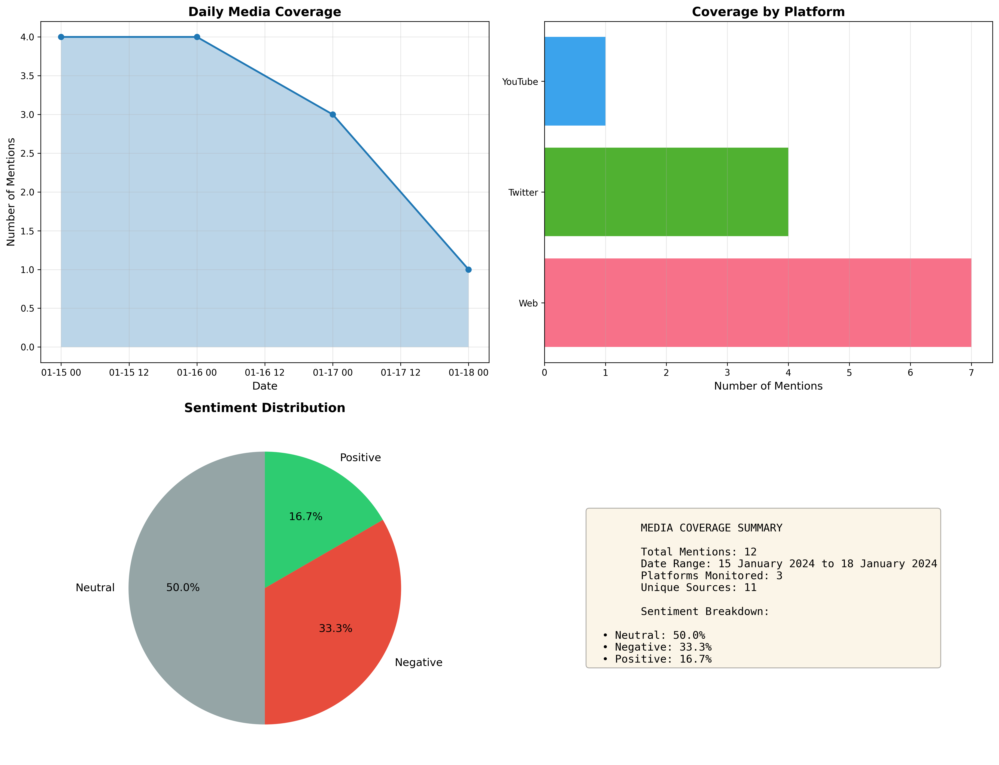
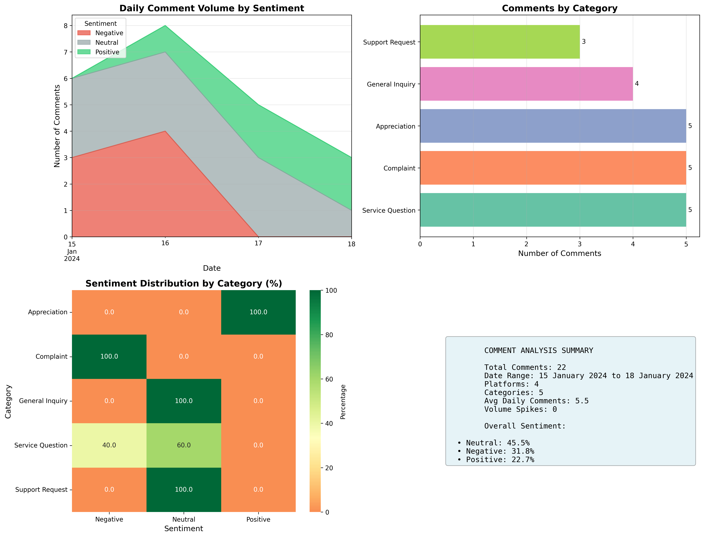

# Crisis Communication Tools

Python scripts for analysing media coverage and social media sentiment during crises. These tools were developed based on real-world crisis management experience and are designed for rapid deployment during active incidents.

## 🚀 Quick Start

### Installation

```bash
pip install -r requirements.txt
```

### Basic Usage

1. **Prepare your data** using the CSV templates in `/templates`
2. **Run individual tools** or generate complete reports

## 📊 Tools Overview

### 1. Media Coverage Tracker (`media_tracker.py`)

Analyses media mentions across platforms and generates visual reports.

**Features:**
- Daily coverage trends
- Platform distribution
- Sentiment analysis
- Source breakdown
- Automated report generation

**Usage:**
```python
from media_tracker import MediaTracker

tracker = MediaTracker('your_media_data.csv')
tracker.export_report('media_report.png')
```

**Input format:** See `templates/media_coverage_template.csv`

---

### 2. Sentiment Analyser (`sentiment_analyzer.py`)

Analyses social media comments by category and sentiment.

**Features:**
- Daily volume tracking with sentiment breakdown
- Category analysis
- Volume spike detection
- Platform comparison
- Sentiment heatmaps

**Usage:**
```python
from sentiment_analyzer import SentimentAnalyzer

analyzer = SentimentAnalyzer('your_comments_data.csv')
analyzer.export_report('sentiment_report.png')

# Detect unusual spikes
spikes = analyzer.identify_spikes(threshold_multiplier=2.0)
```

**Input format:** See `templates/comments_template.csv`

---

### 3. Crisis Report Generator (`crisis_report_generator.py`)

Generates comprehensive PDF reports combining media and social analysis.

**Perfect for:**
- Executive morning briefings
- Daily situation reports
- Stakeholder updates

**Features:**
- 4-page PDF report with cover, executive summary, and detailed analysis
- Quick text summary for email/Slack
- Automated risk assessment (Low/Moderate/High)
- Combined media + social metrics

**Usage:**
```python
from crisis_report_generator import CrisisReportGenerator

report = CrisisReportGenerator(
    media_file='media_coverage.csv',
    comments_file='comments.csv',
    crisis_name='Cybersecurity Incident'
)

# Generate full PDF
report.generate_pdf_report('crisis_report.pdf')

# Get a quick summary for email
print(report.generate_quick_summary())
```

---

## 📋 Data Collection Workflow

### During a Crisis

**Real-time tracking:**
1. Monitor all media mentions and social comments
2. Record data in Excel/CSV with required fields
3. Run reports as needed (typically daily for morning briefings)

**Required fields for media coverage:**
- `Date`: Publication date (format: DD Month YYYY, e.g., 15 January 2024)
- `Source`: Media outlet name
- `Platform`: Web, Twitter, Facebook, etc.
- `URL`: Link to article/post
- `Sentiment`: Positive, Neutral, or Negative
- `Category`: Custom categories for your situation

**Required fields for comments:**
- `Date`: Comment date (format: DD Month YYYY, e.g., 15 January 2024)
- `Platform`: Social platform
- `Category`: Comment type (Complaint, Question, etc.)
- `Sentiment`: Positive, Neutral, or Negative
- `Comment_ID`: Unique identifier

---

## 📊 Report Examples

### Media Coverage Report


### Sentiment Analysis Report


### Full Crisis Report (PDF)
[📄 Download Example Crisis Report](../examples/sample_data/output/crisis_report.pdf)

**Report Contents:**
- Page 1: Cover with key metrics
- Page 2: Executive summary with risk assessment
- Page 3: Detailed media analysis
- Page 4: Detailed social media analysis

---

## 🎯 Use Cases

### During Active Crisis
- **Morning briefings:** Generate overnight report for 9am leadership meeting
- **Hourly monitoring:** Track sentiment shifts in real-time
- **Spike detection:** Get alerts when comment volume exceeds the normal baseline

### Post-Crisis Analysis
- **Timeline reconstruction:** Understand how narrative evolved
- **Effectiveness assessment:** Measure impact of communications
- **Lessons learned:** Identify what worked and what didn't

---

## ⚙️ Configuration

### Customisation Options

**Sentiment categories:** Modify to match your classification
```python
# In sentiment_analyzer.py
SENTIMENT_COLORS = {
    'Positive': '#2ecc71',
    'Neutral': '#95a5a6', 
    'Negative': '#e74c3c'
}
```

**Spike detection threshold:** Adjust sensitivity
```python
# Default: 2x average = spike
spikes = analyzer.identify_spikes(threshold_multiplier=2.0)

# More sensitive: 1.5x average
spikes = analyzer.identify_spikes(threshold_multiplier=1.5)
```

**Report styling:** Modify colours, fonts,and  layout in each script

---

## 🔧 Troubleshooting

### Common Issues

**"File not found" error:**
- Ensure CSV file path is correct
- Use absolute paths if relative paths don't work

**Dates not parsing:**
- Ensure date format is DD Month YYYY (e.g., 15 January 2024)
- Check for empty date cells
- The tools accept both DD Month YYYY and YYYY-MM-DD formats

**Missing sentiment values:**
- All records must have Positive, Neutral, or Negative sentiment
- Check for typos in the sentiment column

**Empty plots:**
- Verify the data file has content
- Check the date range is correct

---

## 📈 Best Practices

### Data Collection
- **Consistency:** Use the same categories throughout the crisis
- **Timeliness:** Update data at regular intervals
- **Completeness:** Don't skip sentiment classification
- **Verification:** Double-check URLs and sources

### Reporting
- **Daily cadence:** Generate reports at the same time each day
- **Clear naming:** Use date in filename (e.g., `report_2024-01-15.pdf`)
- **Archive:** Keep all reports for post-crisis analysis
- **Distribution:** Define who receives reports and when

---

## 🤝 Contributing

Improvements and additional features welcome! Common requests:
- Additional visualisation types
- Integration with monitoring APIs
- Real-time dashboards
- Multi-language support

---

## 📄 License

MIT License - Free to use and adapt for your organisation.

---

## ✍️ Author

Developed based on 9+ years of crisis communication experience in highly regulated environments.

For questions or suggestions, open an issue on GitHub.
